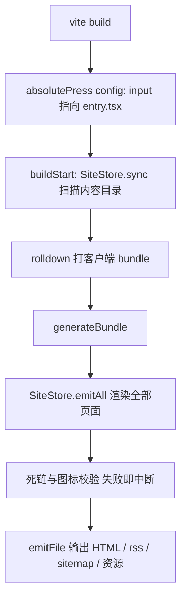

# 整体架构

absolute-press 的实现是一个 Vite 插件（`src/node/build/plugin.ts` 的 `absolutePress()`）加一套浏览器运行时（`src/client/runtime/`）。没有独立的 CLI，没有插件系统，`vite build` 和 `vite dev` 就是全部入口。这篇从构建流程开始，讲清各层的契约。

## 两阶段构建

构建在同一个 `vite build` 进程里分两步走完：

1. 客户端打包。插件在 `config()` 钩子里把 rollup 输入指到 `src/client/runtime/entry.tsx`，rolldown 把主题 chrome、island 组件、样式打成一个 bundle。
2. 逐页 SSG。`generateBundle` 阶段拿到 bundle 产物里的入口 chunk 与 CSS 文件名，`SiteStore.emitAll()`（`src/node/build/site.ts`）渲染所有页面、套 shell，连同 rss.xml、sitemap.xml、robots.txt、内容图片、KaTeX 资源一起通过 `emitFile` 输出。

死链检查和 frontmatter 图标校验也在这个阶段做，发现即 `this.error` 让构建失败——坏链路和未注册图标没有机会进产物。



**源码：**

````md

````

两阶段合在一个进程里，是因为页面渲染本身不依赖客户端 bundle 的内容，只需要它的产物文件名——shell 里那行 `<script type="module" src="...">`。`SiteStore` 同时持有 markdown 渲染器与页面缓存，dev 中间件和构建发射器共用它，两条路径渲染同一份 HTML。

dev 模式没有 bundle 阶段：插件注册 `appType: 'custom'`，中间件按 URL 直接渲染对应页面（`SiteStore.devHtml()`），入口脚本以 `/@fs/` URL 指向框架源码，由 Vite 按需编译。

## 页面 shell

`src/node/build/shell.ts` 的 `renderShell()` 拼出每个页面的完整 HTML。组成部分按 head 内的顺序：

- 字符集、viewport、`title`（`页面标题 | 站点标题`，相同则只留站点标题）、description、canonical、hreflang alternates、RSS autodiscovery、og/twitter meta。
- 防 FOUC 内联脚本：在任何 CSS 之前恢复主题（`html[data-theme="dark"]`）与侧边栏宽度，避免首屏闪白/闪宽。
- 阻塞渲染的样式表。KaTeX 的约 23KB CSS 只在页面渲染出公式时才注入；动态 chunk（Mermaid、DocSearch 等）的 CSS 不进 head，由 Vite 的 preload 运行时按需注入。
- body：挂载点、渲染好的正文 HTML、payload JSON、入口 script。

payload 是 `<script type="application/json" id="__AP_DATA__">` 里的序列化 `PagePayload`（类型定义在 `src/shared/types.ts`），装着导航树、侧边栏树、页面 meta、站点集成配置。构建期把客户端要用的数据全部序列化进 HTML，运行时就不需要再请求任何数据接口。序列化时把 `<` 转义为 `\u003c`，防止 JSON 里的 `</script>` 提前闭合标签。

## 挂载契约

shell 的 body 固定输出四个挂载点（另有 `#ap-footer` 放页脚）：

```html
<div id="ap-nav"></div>
<aside id="ap-sidebar"></aside>
<main id="ap-content">${content}</main>
<div id="ap-toc"></div>
```

`entry.tsx` 的执行序列很短，可以完整看：

```ts
function main(): void {
  const payload = pagePayload();
  if (!payload) return;
  mountTheme(payload);
  registerIslands();
  hydrateIslands();
  // ...tabs、代码块工具、图片放大等
}
```

`mountTheme()` 读 payload，把导航栏、侧边栏、TOC、页脚这些 chrome 挂到对应挂载点；`#ap-content` 例外——里面的正文是构建期的静态 HTML，客户端只激活其中的 `[data-ap-island]` 占位节点（hydration，本文称客户端激活），正文 DOM 本身不参与任何框架渲染。正文与 chrome 的边界就是这套契约：`#ap-*` 挂载点 id、渲染器输出的 `ap-container--*` 等 class，两边各自演进，契约不动。

## base 自动检测

站点可能部署在任意子路径下（GitHub Pages 的 `/repo/`、自己的域名根），产物里不能出现写死的绝对前缀。方案是按页面深度生成相对前缀：

```ts
export function baseOf(route: string): string {
  const depth = route.split('/').length - 2;
  return '../'.repeat(Math.max(0, depth));
}
```

根页 `''`，深一层 `'../'`，依此类推。所有资源 URL 和站内链接都经它拼接，整站产物可以原样搬到任何子路径。相对前缀的另一个好处是 `file://` 直接打开产物也能用，调试不需要起服务器。

## 渲染缓存双策略

markdown 渲染是全量构建的主要开销，`SiteStore.renderPage()` 按文件缓存渲染结果。dev 和构建的缓存新鲜度判断不同：

```ts
if (cached) {
  if (this.trustWatcher) return cached;
  if (cached.mtimeMs === fs.statSync(page.filePath).mtimeMs) return cached;
}
```

构建没有 watcher，每次发射用 mtime 比对，未变更的页面直接复用缓存，一次全量构建里每页最多渲染一次。dev 里 watcher 的 `change` 事件已经精确到文件（`invalidate()` 删单页缓存，`add`/`unlink` 触发防抖后的全量重扫），如果缓存命中前再 stat 一遍，每个 dev 请求都要对全站文件做 N 次系统调用，所以 dev 直接信任 watcher。

Shiki 渲染器同样被缓存：它按全站围栏语言集合创建（避免默认加载全部语法的约 2s 冷启动），dev 里编辑引入了新语言时打 `langsDirty` 标记，中间件在下次请求前重建渲染器并清空渲染缓存——否则新语言的代码块会以纯文本高亮，直到重启。

## Speculation Rules

MPA 每次导航都是完整页面加载，目标页的阻塞 CSS 没就绪时 Chrome 会画出未样式化的文档（页面间闪烁）。构建产物在 head 末尾注入一份 document 级 Speculation Rules：hover 预取目标 HTML，pointerdown 开始预渲染，激活时页面已经备好。规则只匹配同源链接，跳过带 query 的 URL 和纯锚点链接；Safari 和 Firefox 忽略这个 script 类型，退回普通导航。dev 不注入——按需编译的语义下预渲染没有意义。

## 数据契约

构建侧和运行侧共享的类型集中在 `src/shared/types.ts`：`PageFrontmatter`（只认六个键）、`PageMeta`、`PagePayload`、`NavItem` 等。这个文件是全链路的真相源，改动它意味着 payload 序列化、客户端渲染、构建期聚合要一起动，所以注释里标了「改动需慎重」。内置 island 名单在 `src/shared/islands.ts`，运行时的注册表有编译期覆盖检查，防止名单和实现脱节。
