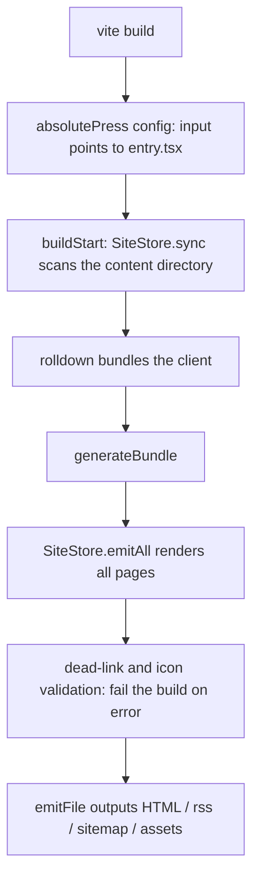

# Architecture

absolute-press is implemented as a Vite plugin (`absolutePress()` in `src/node/build/plugin.ts`) plus a browser runtime (`src/client/runtime/`). There is no separate CLI and no plugin system; `vite build` and `vite dev` are the only entry points. This page starts from the build flow and explains the contract of each layer.

## Two-phase build

The build completes in two steps inside a single `vite build` process:

1. Client bundling. In the `config()` hook the plugin points the rollup input at `src/client/runtime/entry.tsx`; rolldown bundles the theme chrome, island components, and styles into one bundle.
2. Per-page SSG. In the `generateBundle` phase, with the entry chunk and CSS filenames taken from the bundle output, `SiteStore.emitAll()` (`src/node/build/site.ts`) renders all pages, wraps them in the shell, and emits them via `emitFile` together with rss.xml, sitemap.xml, robots.txt, content images, and KaTeX assets.

Dead-link checking and frontmatter icon validation also happen in this phase; any failure calls `this.error` and fails the build — broken links and unregistered icons never reach the output.



**Source:**

````md

````

The two phases share one process because page rendering does not depend on the client bundle's contents, only on its output filenames — the `<script type="module" src="...">` line in the shell. `SiteStore` holds both the markdown renderer and the page cache; the dev middleware and the build emitter share it, so both paths render the same HTML.

Dev mode has no bundle phase: the plugin registers `appType: 'custom'`, and middleware renders the page for each URL directly (`SiteStore.devHtml()`). The entry script is served as a `/@fs/` URL pointing at the framework source, compiled on demand by Vite.

## Page shell

`renderShell()` in `src/node/build/shell.ts` assembles each page's complete HTML. The components, in head order:

- charset, viewport, `title` (`Page Title | Site Title`, site title alone if identical), description, canonical, hreflang alternates, RSS autodiscovery, og/twitter meta.
- Anti-FOUC inline script: restores the theme (`html[data-theme="dark"]`) and the sidebar width before any CSS, avoiding a white flash or width flash on first paint.
- Render-blocking stylesheets. KaTeX's ~23KB CSS is injected only when the page renders formulas; the CSS of dynamic chunks (Mermaid, DocSearch, etc.) does not go into head — Vite's preload runtime injects it on demand.
- body: mount points, rendered body HTML, payload JSON, entry script.

The payload is a serialized `PagePayload` (type defined in `src/shared/types.ts`) inside `<script type="application/json" id="__AP_DATA__">`, carrying the nav tree, sidebar tree, page meta, and site integration config. Serializing all client-side data into HTML at build time means the runtime never needs a data endpoint. During serialization `<` is escaped to `\u003c` so a `</script>` inside the JSON cannot close the tag early.

## Mount contract

The shell body always outputs four mount points (plus `#ap-footer` for the footer):

```html
<div id="ap-nav"></div>
<aside id="ap-sidebar"></aside>
<main id="ap-content">${content}</main>
<div id="ap-toc"></div>
```

The execution sequence of `entry.tsx` is short enough to read in full:

```ts
function main(): void {
  const payload = pagePayload();
  if (!payload) return;
  mountTheme(payload);
  registerIslands();
  hydrateIslands();
  // ...tabs, code-block tooling, image zoom, etc.
}
```

`mountTheme()` reads the payload and mounts the chrome — navbar, sidebar, TOC, footer — onto the corresponding mount points; `#ap-content` is the exception. The body inside it is static HTML from the build; the client only hydrates the `[data-ap-island]` placeholder nodes within it (client-side hydration), and the body DOM itself never participates in any framework rendering. The boundary between body and chrome is exactly this contract: the `#ap-*` mount point ids and the `ap-container--*` classes emitted by the renderer. Both sides evolve independently; the contract does not move.

## Automatic base detection

A site may deploy under any subpath (GitHub Pages `/repo/`, a domain root), so the output must not contain hardcoded absolute prefixes. The solution is a relative prefix generated from page depth:

```ts
export function baseOf(route: string): string {
  const depth = route.split('/').length - 2;
  return '../'.repeat(Math.max(0, depth));
}
```

The root page gets `''`, one level deeper gets `'../'`, and so on. All asset URLs and internal links are joined through it, so the whole output can be moved to any subpath as-is. A side benefit of relative prefixes: the output also works when opened directly over `file://`, so debugging needs no server.

## Dual-strategy render cache

Markdown rendering is the main cost of a full build; `SiteStore.renderPage()` caches render results per file. Dev and build judge cache freshness differently:

```ts
if (cached) {
  if (this.trustWatcher) return cached;
  if (cached.mtimeMs === fs.statSync(page.filePath).mtimeMs) return cached;
}
```

A build has no watcher, so each emit compares mtimes; unchanged pages reuse the cache, and each page renders at most once per full build. In dev, the watcher's `change` events are already file-precise (`invalidate()` drops the single-page cache; `add`/`unlink` trigger a debounced full rescan). Stat-ing every file before a cache hit would mean N syscalls across the whole site per dev request, so dev trusts the watcher directly.

The Shiki renderer is cached the same way: it is created from the site's full set of fence languages (avoiding the ~2s cold start of loading all grammars by default). When an edit in dev introduces a new language, a `langsDirty` flag is set, and the middleware rebuilds the renderer and clears the render cache before the next request — otherwise code blocks in the new language would render as plain text until restart.

## Speculation Rules

Every MPA navigation is a full page load; if the target page's blocking CSS is not ready, Chrome paints an unstyled document (a flash between pages). The build output injects a document-level Speculation Rules block at the end of head: hover prefetches the target HTML, pointerdown starts prerendering, and by activation the page is ready. The rules only match same-origin links, skip URLs with queries, and skip pure anchor links; Safari and Firefox ignore this script type and fall back to normal navigation. Dev does not inject it — prerendering is meaningless under on-demand compilation.

## Data contract

Types shared between the build side and the runtime live in `src/shared/types.ts`: `PageFrontmatter` (six keys only), `PageMeta`, `PagePayload`, `NavItem`, and so on. This file is the source of truth for the whole pipeline; changing it means payload serialization, client rendering, and build-time aggregation all change together, so its comments carry a "change with care" warning. The built-in island list lives in `src/shared/islands.ts`; the runtime registry has a compile-time coverage check so the list and the implementation cannot drift apart.
