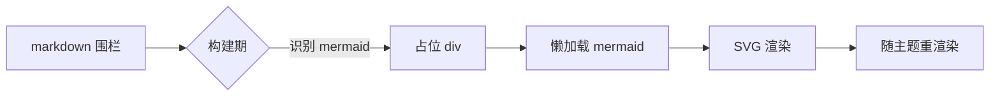
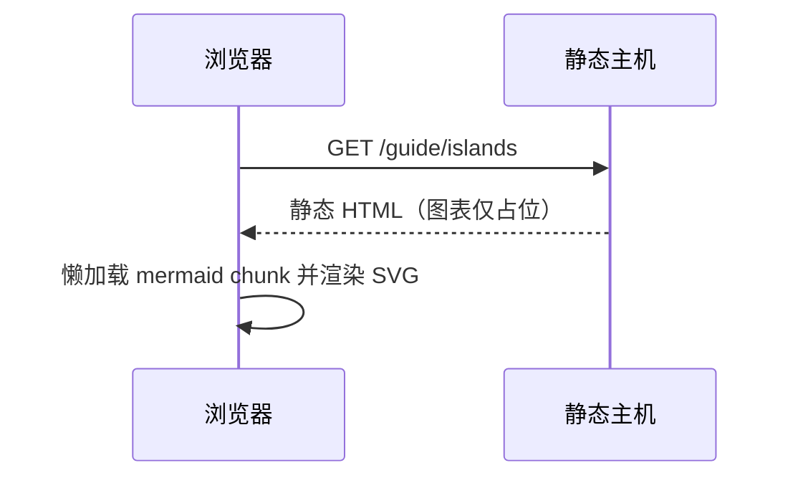

# Islands

Content is fully static by default and takes no part in client-side activation; all interactivity is concentrated in islands: at build time a component is pre-rendered into a `<div data-ap-island>` placeholder, and only these nodes execute code in the browser — the rest of the content stays pure HTML. The built-in list lives in `src/shared/islands.ts`, and the runtime registry has a compile-time coverage check (it must cover exactly the built-in list).

## Syntax

Write PascalCase tags directly in markdown:

```md
<Tag prop="string" :num="1" :ok="true">inner markdown</Tag>
```

- An attribute with a `:` prefix parses its value as JSON (number/boolean/array/object); otherwise it is a string
- Keys of `:` JSON attributes are normalized to camelCase (`:box-data` → the component reads `boxData`), matching component prop naming; plain string attributes pass through as-is
- Valueless attributes: `flag` → the string `"true"`, `:flag` → the boolean `true`
- Tags inside fenced code blocks and inline code are not scanned
- The props a component receives are the `data-props` JSON plus `childrenHtml` (the pre-rendered HTML of the inner markdown); the component may render it (PasswordGate uses it to hide content) or ignore it (Counter)
- Islands are block-level only: the placeholder is a block div, so never put one inside an inline paragraph

## Built-in islands

Six built in: Mermaid / G2Plot / ZoomedImg / ExpandableList / Giscus / PasswordGate.

| island         | Usage                                                    | Activation                            |
| -------------- | -------------------------------------------------------- | ------------------------------------- |
| Mermaid        | `mermaid` fence or `<Mermaid chart="...">`               | write the fence or tag in markdown    |
| G2Plot         | `<G2Plot type :data :options>`                           | write the tag in markdown             |
| ZoomedImg      | `<ZoomedImg src alt title>`                              | write the tag in markdown             |
| ExpandableList | `<ExpandableList>` + `@@@` entries                       | write the tag and entries in markdown |
| Giscus         | auto-mounted at the end of article pages once configured | no manual tag                         |
| PasswordGate   | auto-wraps pages matching `encrypt` rules                | no manual tag                         |

## Mermaid

The easiest form is a mermaid fence — a placeholder at build time, then the browser lazily loads mermaid (with the elk layout engine) on demand and renders SVG, re-rendering on light/dark theme switches:



**Source:**

````md

````

You can also write the tag explicitly, with the `chart` attribute as the diagram source:

<Mermaid chart="graph LR; A[Markdown] --> B{island?}; B -->|是| C[预渲染+激活]; B -->|否| D[纯静态 HTML];" />

**Source:**

```md
<Mermaid chart="graph LR; A[Markdown] --> B{island?}; B -->|是| C[预渲染+激活]; B -->|否| D[纯静态 HTML];" />
```

A page can hold any number of diagrams. The sequence diagram below exists to verify interaction: the rendered diagram is wrapped in a d3-zoom canvas — Ctrl/Cmd + wheel (pinch on trackpads is equivalent) zooms, drag pans, double-click or the top-right button resets; a plain wheel scroll does not zoom, the chart scrolls past and the page keeps scrolling:



**Source:**

````md

````

## G2Plot

`type` picks the chart type; `:data` and `:options` take JSON. `options` passes through wholesale to the G2Plot constructor, so native capabilities go straight into options — an x-axis slider pays off with many data points; drag the slider under the chart below to zoom the x-axis view:

<G2Plot
  type="line"
  :data='[{"m":"1","v":14},{"m":"2","v":17},{"m":"3","v":15},{"m":"4","v":21},{"m":"5","v":25},{"m":"6","v":23},{"m":"7","v":29},{"m":"8","v":31},{"m":"9","v":27},{"m":"10","v":33},{"m":"11","v":30},{"m":"12","v":36}]'
  :options='{"xField":"m","yField":"v","smooth":true,"height":300,"animation":false,"slider":{"start":0,"end":1}}'
/>

**Source:**

```md
<G2Plot
  type="line"
  :data='[{"m":"1","v":14},{"m":"2","v":17},{"m":"3","v":15},{"m":"4","v":21},{"m":"5","v":25},{"m":"6","v":23},{"m":"7","v":29},{"m":"8","v":31},{"m":"9","v":27},{"m":"10","v":33},{"m":"11","v":30},{"m":"12","v":36}]'
  :options='{"xField":"m","yField":"v","smooth":true,"height":300,"animation":false,"slider":{"start":0,"end":1}}'
/>
```

Charts without axes likewise take plain options. Supported `type` values: line / area / bar / column / pie / scatter / radar / rose / funnel / histogram / gauge / liquid / progress / ring-progress / bullet / waterfall. A pie chart:

<G2Plot
  type="pie"
  :data='[{"type":"内置","value":5},{"type":"自定义","value":1}]'
  :options='{"angleField":"value","colorField":"type","height":260,"legend":{"position":"bottom"},"label":{"type":"outer"}}'
/>

**Source:**

```md
<G2Plot
  type="pie"
  :data='[{"type":"内置","value":5},{"type":"自定义","value":1}]'
  :options='{"angleField":"value","colorField":"type","height":260,"legend":{"position":"bottom"},"label":{"type":"outer"}}'
/>
```

For the options shape of each chart type, defer to the [G2Plot docs](https://g2plot.antv.antgroup.com/); the island passes options through without validation (the G2Plot runtime validates). The island's JSON attribute parsing window caps at 64KB, plenty for regular data; with many data items, compress keys (like `m`/`v` above), or move data into a TS data module of a site island and keep only the tag in markdown.

## ZoomedImg

A click-to-zoom image island sharing a global photoSwipe lightbox (esc or click to close), suited to screenshots and diagram photos that need closer inspection. The one below opens on click:

<ZoomedImg src="https://github.com/github.png" alt="GitHub Octocat" title="Click to zoom" />

**Source:**

```md
<ZoomedImg src="https://github.com/github.png" alt="GitHub Octocat" title="Click to zoom" />
```

A remote URL `src` passes to the client as-is; relative paths (`./` `../`) and site-absolute paths (`/images/...`) resolve at build time through the same asset pipeline as regular markdown images (copied at build, rewritten per page depth). Two optional props help migrating old content: `scale` (container width percentage; `"60%"` / `"0.6"` / `60` all work, natural width by default) and `mask` (when `true`, the image hides behind a blur mask first, shows on click, and zooms on the next click).

## ExpandableList

An expandable table list: entry data plus one markdown block per entry, aimed at search/sort/expand-style long lists (100+ entries are fine). At build time entries render into a static table (fully expanded without JS, indexed by SEO as usual); after activation it offers search, sorting, expand/collapse all, and per-row folding. A hint bubble saying "Click a table row to expand its details!" sits above the table, rows end with an arrow that rotates with the expand state, and expandable rows get a theme-colored outline on hover.

Entries are separated by `@@@ Title` lines (up to 3 leading spaces; the title is single-line plain text); content before the first `@@@` is the preamble, rendered statically above the toolbar. Entry bodies are regular markdown — containers, tables, images, and code blocks all work. The list below is fully operational — try searching "container" or "inline code", then sort by title:

<ExpandableList>

@@@ Nested containers

Entries can hold `:::` containers, tables, and footnotes:

::: warning Note
Entry content renders independently at build time; its headings do not enter the page TOC.
:::

| Syntax  | Meaning      |
| ------- | ------------ |
| `@@@ x` | new entry x  |
| `@@@@`  | regular text |

@@@ Code blocks

An `@@@` line inside a fenced code block is content, not a separator:

```md
@@@ this line sits inside a code fence and is not split
```

`<Tag>` inside inline code is not scanned either.

@@@ Nested island

Entry content can contain other islands (islands remain block-level):

<ZoomedImg src="https://github.com/github.png" alt="GitHub Octocat" title="Click to zoom" />

Click-to-zoom works after activation; when search/sort moves an entry out of the list and back, it remounts.

@@@ Empty title

`@@@` with no title still works; the list shows it as an untitled entry.

</ExpandableList>

**Source (excerpt):**

````md
<ExpandableList>

@@@ Nested containers

::: warning Note
Entry content renders independently at build time.
:::

@@@ Code blocks

```md
@@@ this line sits inside a code fence and is not split
```

@@@ Nested island

<ZoomedImg src="..." alt="..." title="..." />

@@@ Empty title

</ExpandableList>
````

Props (all optional):

- `:searchable="false"` / `:sortable="false"`: hide the search box / sort dropdown (mind the `:` prefix; the string `"false"` also counts as off)
- `:columns='["Title","Length",…]'`: header labels; item 1 is the title column; omit it to render no header row
- UI strings follow the page language: matched by `<html lang>` prefix (`en-US` → English, unregistered languages fall back to Chinese), no prop needed

With search and sort off, the toolbar keeps only the expand/collapse buttons and the count:

<ExpandableList :searchable="false" :sortable="false">

@@@ Folding only

With search and sort off, per-entry folding and expand/collapse all still work.

@@@ Second entry

A shorter toolbar, a quieter list.

</ExpandableList>

**Source:**

```md
<ExpandableList :searchable="false" :sortable="false">

@@@ Folding only

With search and sort off, per-entry folding and expand/collapse all still work.

@@@ Second entry

A shorter toolbar, a quieter list.

</ExpandableList>
```

### Table columns and headers

The line after an `@@@` line can carry one `@@ meta` line (single line, inline markdown), rendered as that row's meta cells — when migrating "table + expanding row" lists, it holds column info like duration or rating. Meta splits into columns on `|` (each column is still inline markdown; `\|` is an escaped pipe, and `|` inside inline code does not split); the `:columns` prop (JSON array) provides the header for each column: item 1 is the title column, the rest map to meta's `|` segments in order. When meta has fewer segments than headers, cells are padded empty; extra segments still render (headers padded empty). Pure-numeric cells follow the old site's rating rule: ≥10 bold green, ≤0 red. On narrow screens (<768px) the title column widens, and wide tables with ≥4 meta columns scroll horizontally inside the container:

<ExpandableList :columns='["Title","Length","Story","Art","Notes"]'>

@@@ KARAKARA
@@ 2021-08-25 ~ ? | 3.3 | 5 | Dropped · nothing to say

@@@ サルテ
@@ 3h49min | 7.7 | 2.8 | also known as Salute

</ExpandableList>

**Source:**

```md
<ExpandableList :columns='["Title","Length","Story","Art","Notes"]'>

@@@ KARAKARA
@@ 2021-08-25 ~ ? | 3.3 | 5 | Dropped · nothing to say

@@@ サルテ
@@ 3h49min | 7.7 | 2.8 | also known as Salute

</ExpandableList>
```

Old-style single-segment meta without `|` (`@@ 23h · story 9`) still renders as one column — fully backward compatible.

Behavior details:

- `@@@` titles are plain text with no inline markdown; `@@@@` and longer `@` runs are regular text
- Headings (`##`) inside entries do not enter the page TOC; footnote ids are namespaced per fragment and never clash with the host page
- The static HTML is a fully expanded table (good for SEO and no-JS reading); after activation everything collapses by default, causing one layout settle
- Islands inside entries (the ZoomedImg above) activate; entries remount when search/sort removes and returns them — heavy lazy-loading islands like Mermaid/G2Plot are best placed sparingly
- Search is multi-keyword AND substring matching (case-insensitive, hits title/meta/body); sorting uses `localeCompare` natural comparison
- Customization: style classes live under the `.ap-xlist*` namespace (`src/client/islands/ExpandableList.css`), all driven by `--c-*` theme variables — override the variables to restyle; UI strings live in the `xlist` section of `shared/i18n` (zh is the shape source of truth)

## Giscus

The comment island is auto-mounted by the build layer at the end of article pages; no manual tag in markdown. Non-article pages like the home page and archives get none. Site config:

```ts
giscus: {
  repo: 'owner/repo',
  repoId: 'R_xxx',
  category: 'General',
  categoryId: 'DIC_xxx',
}
```

This site carries real giscus credentials, so every article (including this page) has a comment section at the bottom — scroll down to see it. The comment iframe follows the site's light/dark theme via postMessage; flipping the theme neither reloads the iframe nor loses comment state. When comments coexist with the related-article graph, the graph sits above the comment section. Setup steps and repo prerequisites are in [Search and comments](./search-comments.md).

## PasswordGate

The password-gate island is likewise auto-applied by the build layer to pages matching `encrypt` rules — nothing handwritten. The [encryption demo page](./secret.md) is a live example; mechanism and limits are in [Encryption](./encrypt.md).

## Site-defined island: Counter

Capabilities beyond the built-in list are added via the site config `islands` (this site's vite.config.ts registers `Counter: 'docs/islands/Counter.tsx'`), after which any markdown page can use it directly. This is a real working counter:

<Counter :initial="5" label="Clicks">

**Inner markdown** is pre-rendered at build time; the Counter component itself does not render `childrenHtml` and shows a button after activation.

</Counter>

**Source:**

```md
<Counter :initial="5" label="Clicks">

**Inner markdown** is pre-rendered at build time; the Counter component itself does not render `childrenHtml` and shows a button after activation.

</Counter>
```

The component source is about twenty lines — the minimal reference for a custom island:

```ts
import type { IslandComponent } from 'absolute-press/client';
import { createEffect, createSignal } from 'solid-js';

const Counter: IslandComponent = props => {
  const initial = typeof props['initial'] === 'number' ? props['initial'] : 0;
  const label = typeof props['label'] === 'string' ? props['label'] : 'count';
  const [count, setCount] = createSignal(initial);
  const btn = document.createElement('button');
  btn.type = 'button';
  btn.className = 'ap-demo-counter';
  btn.addEventListener('click', () => setCount(c => c + 1));
  // Solid 2.0 effect API: (compute, effectFn).
  createEffect(
    () => count(),
    v => {
      btn.textContent = `${label}: ${v}`;
    },
  );
  return btn;
};

export default Counter;
```

Key points: the module default-exports an `IslandComponent` (`import type { IslandComponent } from 'absolute-press/client'`); the tag name (`Counter`) matches the config key, PascalCase. `IslandProps` carries an optional `childrenHtml` (the pre-rendered HTML of the inner markdown) on top of its own props. When you need page metadata (locale, base, page title, etc.), read the page payload via `pagePayload()` from the same entry: every call reads live, and on client-side soft navigation the router syncs the script content to the current page.

### Framework utilities available to site islands

`absolute-press/client` also exports the same set of shared utilities the built-in islands use; site islands import them directly instead of reinventing wheels or deep-importing internal paths:

| Export                            | Purpose                                                                                                                                     |
| --------------------------------- | ------------------------------------------------------------------------------------------------------------------------------------------- |
| `pagePayload()`                   | read the current page payload (locale, base, title, navbar/sidebar, etc.); follows soft navigation automatically                            |
| `hydrateIslands(root?)`           | activate `[data-ap-island]` placeholders under `root`; re-activates nested islands after an island rebuilds DOM                             |
| `islandRegistry()`                | the full current island registry (built-in + site)                                                                                          |
| `mountComponent(comp, el, props)` | mount a Solid component onto an existing DOM node (direct mount under MPA, not full-page activation); event delegation works out of the box |
| `cx(...cls)`                      | conditional className joining (static strings, scannable by UnoCSS)                                                                         |
| `flagOn(value, fallback?)`        | parse a boolean prop: JSON booleans, `"false"`/`"0"`, and bare attributes handled uniformly                                                 |
| `pageMessages()`                  | UI message table by `<html lang>` (unknown languages fall back to Chinese)                                                                  |
| `formatMessage(tpl, params)`      | fill `{key}` placeholders in message templates                                                                                              |

These are the same building blocks the built-in islands use — for example, ExpandableList's search toggle uses `flagOn`, its table class names use `cx`, and its toolbar strings use `pageMessages()` + `formatMessage`. A minimal combined example:

```ts
import type { IslandComponent } from 'absolute-press/client';
import { cx, flagOn, formatMessage, pageMessages } from 'absolute-press/client';

const Notice: IslandComponent = props => {
  const t = pageMessages();
  const el = document.createElement('div');
  el.className = cx('my-notice', flagOn(props.compact, false) && 'is-compact');
  const text = typeof props['text'] === 'string' ? props['text'] : '';
  el.textContent = formatMessage(text || '{n} 条新回复', { n: 3 });
  return el;
};

export default Notice;
```

### Reusing the entry pipeline for site islands (entryList)

When a site island wants ExpandableList's "`@@@` entries + static table skeleton" behavior, add the island name to the site config `entryListIslands: ['MyList', …]`, and the build splits `<MyList>` children through the same pipeline: identical `@@@`/`@@` syntax, fence protection, and static skeleton rendering (islands not in the list stay literal). The client component receives this static HTML via `childrenHtml`, splits it back into entries, and fills in its own data (the typical case is a list component where "a TS data module owns the meta columns and markdown keeps only the slot bodies"); nested islands inside entries are re-activated with `hydrateIslands` exported from `absolute-press/client`.

Implementation details of pipeline splitting and activation timing are in [Design and implementation: the islands runtime](./design/islands-runtime.md).

## Constraints and notes

- Islands are block-level only; tags must be PascalCase and on the list (unregistered tags pass through as unknown HTML)
- Headings inside an island's markdown do not enter the page TOC; footnote ids get a prefix to avoid clashing with the host page
- Mermaid / G2Plot lazy chunks are large and load only when used; a page with no charts downloads none of it
