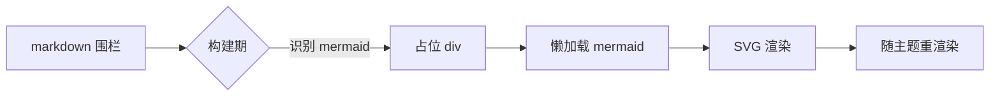
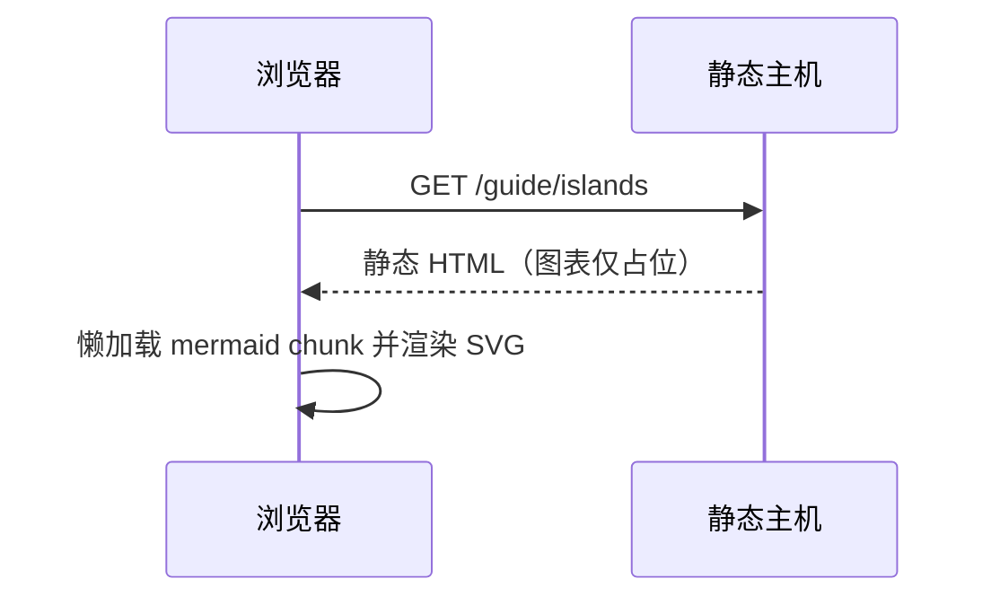

# Islands

正文默认纯静态、不参与客户端激活；交互能力全部收敛在 island 上：构建期把组件预渲染成 `<div data-ap-island>` 占位，浏览器端只有这些节点会执行代码，正文其余部分始终是纯 HTML。内置名单在 `src/shared/islands.ts`，runtime 注册表有编译期覆盖检查（必须恰好覆盖内置名单）。

## 语法

在 markdown 里直接写 PascalCase 标签：

```md
<Tag prop="字符串" :num="1" :ok="true">内部 markdown</Tag>
```

- 属性带 `:` 前缀时值按 JSON 解析（数字/布尔/数组/对象），否则是字符串
- `:` JSON 属性的 key 会归一为 camelCase（`:box-data` → 组件读 `boxData`），与组件 prop 命名一致；普通字符串属性原样透传
- 无值属性：`flag` → 字符串 `"true"`，`:flag` → 布尔 `true`
- 围栏代码块与行内代码里的标签不会被扫描
- 组件收到的 props 是 `data-props` JSON 加上 `childrenHtml`（内部 markdown 的预渲染 HTML）；组件可选择渲染它（PasswordGate 用它藏正文）或忽略（Counter）
- island 仅块级使用：占位是块级 div，不要写进行内段落

## 内置 island

内置六个：Mermaid / G2Plot / ZoomedImg / ExpandableList / Giscus / PasswordGate。

| island         | 用法                                     | 激活方式              |
| -------------- | ---------------------------------------- | --------------------- |
| Mermaid        | `mermaid` 围栏或 `<Mermaid chart="...">` | markdown 写围栏或标签 |
| G2Plot         | `<G2Plot type :data :options>`           | markdown 写标签       |
| ZoomedImg      | `<ZoomedImg src alt title>`              | markdown 写标签       |
| ExpandableList | `<ExpandableList>` + `@@@` 条目          | markdown 写标签与条目 |
| Giscus         | 站点配置后文章页尾部自动挂载             | 不需要手写标签        |
| PasswordGate   | 命中 `encrypt` 规则的页面自动包裹        | 不需要手写标签        |

## Mermaid

最省事的写法是 mermaid 围栏——构建期占位，浏览器端按需懒加载 mermaid（含 elk 布局引擎）渲染成 SVG，随亮暗主题重渲染：



**源码：**

````md

````

也可以显式写标签，`chart` 属性作图源：

<Mermaid chart="graph LR; A[Markdown] --> B{island?}; B -->|是| C[预渲染+激活]; B -->|否| D[纯静态 HTML];" />

**源码：**

```md
<Mermaid chart="graph LR; A[Markdown] --> B{island?}; B -->|是| C[预渲染+激活]; B -->|否| D[纯静态 HTML];" />
```

同一页面可以放任意多张图。下面这张时序图用来验证交互：渲染后的图外面包了一层 d3-zoom 画布，Ctrl/Cmd + 滚轮（触控板捏合等价）缩放，按住拖拽平移，双击或点右上角按钮复位；普通滚轮不缩放，图表滚过即走，页面照常滚动：



**源码：**

````md

````

## G2Plot

`type` 选图表类型，`:data` 与 `:options` 传 JSON。`options` 是全量透传给 G2Plot 构造器的，所以原生能力直接写在 options 里即可——数据点多时横轴 slider 很实用，拖动下方图表的滑块可以缩放横轴视野：

<G2Plot
  type="line"
  :data='[{"m":"1","v":14},{"m":"2","v":17},{"m":"3","v":15},{"m":"4","v":21},{"m":"5","v":25},{"m":"6","v":23},{"m":"7","v":29},{"m":"8","v":31},{"m":"9","v":27},{"m":"10","v":33},{"m":"11","v":30},{"m":"12","v":36}]'
  :options='{"xField":"m","yField":"v","smooth":true,"height":300,"animation":false,"slider":{"start":0,"end":1}}'
/>

**源码：**

```md
<G2Plot
  type="line"
  :data='[{"m":"1","v":14},{"m":"2","v":17},{"m":"3","v":15},{"m":"4","v":21},{"m":"5","v":25},{"m":"6","v":23},{"m":"7","v":29},{"m":"8","v":31},{"m":"9","v":27},{"m":"10","v":33},{"m":"11","v":30},{"m":"12","v":36}]'
  :options='{"xField":"m","yField":"v","smooth":true,"height":300,"animation":false,"slider":{"start":0,"end":1}}'
/>
```

不指定坐标轴的图同样直接写 options。支持的 `type`：line / area / bar / column / pie / scatter / radar / rose / funnel / histogram / gauge / liquid / progress / ring-progress / bullet / waterfall。一张饼图：

<G2Plot
  type="pie"
  :data='[{"type":"内置","value":5},{"type":"自定义","value":1}]'
  :options='{"angleField":"value","colorField":"type","height":260,"legend":{"position":"bottom"},"label":{"type":"outer"}}'
/>

**源码：**

```md
<G2Plot
  type="pie"
  :data='[{"type":"内置","value":5},{"type":"自定义","value":1}]'
  :options='{"angleField":"value","colorField":"type","height":260,"legend":{"position":"bottom"},"label":{"type":"outer"}}'
/>
```

各图表类型的 options 形状以 [G2Plot 文档](https://g2plot.antv.antgroup.com/)为准，island 只透传不校验（由 G2Plot 运行时校验）。island 的 JSON 属性解析窗口上限 64KB，常规数据随便写；数据项特别多时压缩 key（如上面的 `m`/`v`），或把数据交给站点 island 的 TS 数据模块、markdown 只留标签。

## ZoomedImg

点击放大的图片 island，共享全局 photoSwipe lightbox（esc 或点击关闭），适合截图、图表照片这类需要看细节的图。下面这张可以点开：

<ZoomedImg src="https://github.com/github.png" alt="GitHub Octocat" title="点击放大" />

**源码：**

```md
<ZoomedImg src="https://github.com/github.png" alt="GitHub Octocat" title="点击放大" />
```

`src` 为远程 URL 时原样传给客户端；相对路径（`./` `../`）与站点内绝对路径（`/images/...`）由构建期解析，走与普通 markdown 图片相同的资源管线（构建时复制、按页面深度重写）。迁移旧站内容还可用两个可选属性：`scale`（容器宽度百分比，`"60%"` / `"0.6"` / `60` 均可，缺省为自然宽度）与 `mask`（`true` 时先以模糊遮罩隐藏、点击后显示，再点击走放大）。

## ExpandableList

可展开表格列表：条目数据 + 每条一段 markdown 内容，面向「搜索/排序/展开收起」式长列表（条目数 100+ 也没问题）。构建期把条目渲染成一张静态表格（无 JS 时全部展开，SEO 照常收录），激活后提供搜索、排序、全部展开/收起与单行折叠；表格上方常驻一个「点击表格行可以展开详细内容哦！」的提示气泡，行尾有随展开状态旋转的箭头，可展开行 hover 时有主题色描边。

条目用 `@@@ 标题` 行分隔（行首 ≤3 空格缩进，标题是单行纯文本）；第一个 `@@@` 之前的内容是 preamble，静态显示在工具栏上方。条目正文就是普通 markdown，容器、表格、图片、代码块都可用。下面这个列表可以实际操作——试试搜索「容器」、「行内代码」，再按标题排序：

<ExpandableList>

@@@ 嵌套容器

条目里可以放 `:::` 容器、表格、脚注：

::: warning 注意
条目内容在构建期独立渲染，标题不进页面 TOC。
:::

| 语法    | 含义     |
| ------- | -------- |
| `@@@ x` | 新条目 x |
| `@@@@`  | 普通文本 |

@@@ 代码块

围栏代码块里的 `@@@` 行是内容不是分隔符：

```md
@@@ 这一行在代码围栏里，不会被切分
```

行内代码里的 `<Tag>` 也不扫描。

@@@ 嵌套 island

条目内容里可以再写别的 island（island 依旧块级使用）：

<ZoomedImg src="https://github.com/github.png" alt="GitHub Octocat" title="点击放大" />

激活后照常可点击放大；被搜索/排序移出列表再移回来时会重新挂载。

@@@ 空标题

`@@@` 后面不写标题也能成立，列表里显示「未命名条目」。

</ExpandableList>

**源码（节选）：**

````md
<ExpandableList>

@@@ 嵌套容器

::: warning 注意
条目内容在构建期独立渲染。
:::

@@@ 代码块

```md
@@@ 这一行在代码围栏里，不会被切分
```

@@@ 嵌套 island

<ZoomedImg src="..." alt="..." title="..." />

@@@ 空标题

</ExpandableList>
````

Props（均可选）：

- `:searchable="false"` / `:sortable="false"`：隐藏搜索框 / 排序下拉框（注意 `:` 前缀，字符串 `"false"` 也按关闭处理）
- `:columns='["标题","时长",…]'`：表头标签，第 1 项为标题列；不传则不渲染表头行
- UI 文案跟随页面语言：按 `<html lang>` 前缀匹配（`en-US` → 英文，未注册语言回退中文），无需任何 prop

关闭搜索与排序后，工具栏只剩展开/收起按钮和计数：

<ExpandableList :searchable="false" :sortable="false">

@@@ 只剩折叠

关闭搜索与排序后，单条折叠与全部展开/收起仍然可用。

@@@ 第二条

工具栏高度更矮，列表更安静。

</ExpandableList>

**源码：**

```md
<ExpandableList :searchable="false" :sortable="false">

@@@ 只剩折叠

关闭搜索与排序后，单条折叠与全部展开/收起仍然可用。

@@@ 第二条

工具栏高度更矮，列表更安静。

</ExpandableList>
```

### 表格列与表头

`@@@` 行的下一行可以紧跟一条 `@@ 元信息` 行（单行、行内 markdown），渲染为该行的 meta 列单元格——迁移「表格 + 展开行」式列表时用来承载时长/评分这类列信息。meta 用 `|` 切分成多列（每列仍是行内 markdown；`\|` 是转义的竖线，行内代码里的 `|` 不切分），`:columns` 属性（JSON 数组）传入各列表头：第 1 项是标题列，其余依次对应 meta 的 `|` 分列。meta 段数少于列头时补空单元格，多出的段仍渲染（表头补空）；纯数字单元格沿用旧站评分规则：≥10 加粗显绿、≤0 显红。窄屏（<768px）下标题列放宽、meta 列 ≥4 的宽表在容器内横向滚动：

<ExpandableList :columns='["游戏名","时长","剧情","画风","备注"]'>

@@@ KARAKARA
@@ 2021-08-25 ~ ? | 3.3 | 5 | 中断 · 无话可说

@@@ サルテ
@@ 3h49min | 7.7 | 2.8 | 又名 Salute

</ExpandableList>

**源码：**

```md
<ExpandableList :columns='["游戏名","时长","剧情","画风","备注"]'>

@@@ KARAKARA
@@ 2021-08-25 ~ ? | 3.3 | 5 | 中断 · 无话可说

@@@ サルテ
@@ 3h49min | 7.7 | 2.8 | 又名 Salute

</ExpandableList>
```

不带 `|` 的旧式单段 meta（`@@ 23h · 剧情 9`）仍渲染为单列，完全向后兼容。

行为细节：

- `@@@` 标题是纯文本，不支持行内 markdown；`@@@@` 及更长的 `@` 串是普通文本
- 条目内的标题（`##`）不进页面 TOC；脚注 id 按片段隔离，不与宿主页冲突
- 静态 HTML 是全展开的表格（利于 SEO 与无 JS 阅读），激活后默认全部收起，会有一次布局收拢
- 条目内的 island（如上例 ZoomedImg）支持激活；条目因搜索/排序离开列表再回来时会重新挂载，Mermaid/G2Plot 这类懒加载重组件建议慎放
- 搜索为多关键字 AND 子串匹配（不区分大小写，命中标题/meta/正文）；排序用 `localeCompare` 自然比较
- 定制：样式类在 `.ap-xlist*` 命名空间下（`src/client/islands/ExpandableList.css`），全部走 `--c-*` 主题变量，覆盖变量即可换肤；UI 文案在 `shared/i18n` 的 `xlist` 段（zh 为 shape 真相源）

## Giscus

评论 island 由构建层在文章页尾部自动挂载，不需要在 markdown 手写标签；首页、归档等非文章页不挂。站点配置：

```ts
giscus: {
  repo: 'owner/repo',
  repoId: 'R_xxx',
  category: 'General',
  categoryId: 'DIC_xxx',
}
```

本站配置了真实的 giscus 凭证，所以每一篇文章（包括本页）底部都有评论区，往下滚动就能看到。评论 iframe 的亮暗主题通过 postMessage 跟随站点切换，翻转主题不重载 iframe、不丢评论状态；评论与关联文章图共存时，关联图位于评论区上方。接入步骤与仓库前提见[搜索与评论](./search-comments.md)。

## PasswordGate

密码门 island 同样由构建层自动包裹命中 `encrypt` 规则的页面，不手写。[加密演示页](./secret.md)是一个真实生效的例子，机制与边界见[加密](./encrypt.md)。

## 站点自定义 island：Counter

内置名单之外的能力，经站点配置 `islands` 追加（本站 vite.config.ts 注册了 `Counter: 'docs/islands/Counter.tsx'`），之后任何 markdown 页面都能直接用。这是一个真实运行的计数器：

<Counter :initial="5" label="点击次数">

**内部 markdown** 在构建期预渲染；Counter 组件本身不渲染 `childrenHtml`，激活后显示按钮。

</Counter>

**源码：**

```md
<Counter :initial="5" label="点击次数">

**内部 markdown** 在构建期预渲染；Counter 组件本身不渲染 `childrenHtml`，激活后显示按钮。

</Counter>
```

组件源码只有二十来行，是自定义 island 的最小参考：

```ts
import type { IslandComponent } from 'absolute-press/client';
import { createEffect, createSignal } from 'solid-js';

const Counter: IslandComponent = props => {
  const initial = typeof props['initial'] === 'number' ? props['initial'] : 0;
  const label = typeof props['label'] === 'string' ? props['label'] : 'count';
  const [count, setCount] = createSignal(initial);
  const btn = document.createElement('button');
  btn.type = 'button';
  btn.className = 'ap-demo-counter';
  btn.addEventListener('click', () => setCount(c => c + 1));
  // Solid 2.0 effect API: (compute, effectFn).
  createEffect(
    () => count(),
    v => {
      btn.textContent = `${label}: ${v}`;
    },
  );
  return btn;
};

export default Counter;
```

实现要点：模块默认导出 `IslandComponent`（`import type { IslandComponent } from 'absolute-press/client'`）；标签名（`Counter`）与配置 key 一致，PascalCase。`IslandProps` 除自身 props 外带可选的 `childrenHtml`（内部 markdown 的预渲染 HTML）。需要页面元数据（locale、base、页面标题等）时，用同入口导出的 `pagePayload()` 读取页面 payload：每次调用实时读取，客户端软导航时路由会把脚本内容同步到当前页。

### 站点 island 可用的框架工具

`absolute-press/client` 还导出一组内置 island 同款的公共工具，站点 island 直接 import 即可，不必重复造轮子或深 import 内部路径：

| 导出                              | 用途                                                                           |
| --------------------------------- | ------------------------------------------------------------------------------ |
| `pagePayload()`                   | 读当前页 payload（locale、base、标题、navbar/sidebar 等），软导航自动跟随      |
| `hydrateIslands(root?)`           | 激活 `root` 下 `[data-ap-island]` 占位；island 重建 DOM 后重新激活嵌套 island  |
| `islandRegistry()`                | 当前完整 island 注册表（内置 + 站点）                                          |
| `mountComponent(comp, el, props)` | 把 Solid 组件挂到已有 DOM 节点（MPA 下直接挂载，非整页激活），事件委托开箱即用 |
| `cx(...cls)`                      | 条件 className 拼接（静态字符串，UnoCSS 可扫描）                               |
| `flagOn(value, fallback?)`        | 解析布尔 prop：JSON 布尔、`"false"`/`"0"`、裸属性统一处理                      |
| `pageMessages()`                  | 按 `<html lang>` 取 UI 文案表（未知语言回退中文）                              |
| `formatMessage(tpl, params)`      | 填充文案模板里的 `{key}` 占位符                                                |

这些就是内置 island 用的同一批积木——例如 ExpandableList 的搜索框开关用 `flagOn`、表格类名用 `cx`、工具栏文案用 `pageMessages()` + `formatMessage`。一个组合使用的最小示例：

```ts
import type { IslandComponent } from 'absolute-press/client';
import { cx, flagOn, formatMessage, pageMessages } from 'absolute-press/client';

const Notice: IslandComponent = props => {
  const t = pageMessages();
  const el = document.createElement('div');
  el.className = cx('my-notice', flagOn(props.compact, false) && 'is-compact');
  const text = typeof props['text'] === 'string' ? props['text'] : '';
  el.textContent = formatMessage(text || '{n} 条新回复', { n: 3 });
  return el;
};

export default Notice;
```

### 站点 island 复用条目管线（entryList）

站点 island 想复用 ExpandableList 同款「`@@@` 条目 + 静态表格骨架」行为时，把 island 名加进站点配置 `entryListIslands: ['MyList', …]`，构建期就按同一条管线拆分 `<MyList>` 的 children：`@@@`/`@@` 语法、围栏保护、静态骨架渲染完全一致（未加入名单的 island 保持字面量）。客户端组件从 `childrenHtml` 接住这份静态 HTML，按条目拆回并填入自己的数据（典型场景是「TS 数据模块管 meta 列、markdown 只留插槽正文」的列表组件）；条目里的嵌套 island 用 `absolute-press/client` 导出的 `hydrateIslands` 重新激活。

管线拆分与激活时序的实现细节见[设计与实现：islands 运行时](./design/islands-runtime.md)。

## 约束与注意

- island 仅块级使用，标签必须 PascalCase 且在名单内（未注册的标签按未知 HTML 透传）
- island 内部 markdown 的标题不进页面 TOC；脚注 id 加前缀避免与宿主页冲突
- Mermaid / G2Plot 懒加载 chunk 较大，仅用到时加载，页面没有图表就完全不下载
